# Adventure-Works-Insights-Dashboard
---
## Company Overview
Adventure Works is a fictional global manufacturing company specializing in the production and sale of cycling equipment and accessories. With operations spanning Europe, North America, and the Pacific, the company serves a diverse customer base that includes over **10,000** high-value customers.
## Brief
The management team of the company needs a way to track KPIs (revenue, profit, orders and returns), and compare regional performance, analyze product-level trends and identify high value customers.
## Objectives
The goal of this project is to create an interactive dashboard for the management team to help track key performance indicators. 
## Key Questions
1. Which division is the top performer?
2. Which product type leads in both orders and revenue?
3. Which customer demographics placed the highest number of orders?
4. Who are the key high-value customers?
5. Which region or market is generating the highest performance?
6. How effectively is the company meeting its monthly targets?
## Data Collection
I received a folder containing **raw CSV files** with over **50,000** records spanning the period from **2020 to 2022**. The dataset included key attributes such as **dim_customers**, **dim_products**, **dim_calendar**, **dim_territory**, **fact_sales_data**, and **fact_returns_data**. The data was extracted from the folder and imported into **Power Query**, where it underwent thorough cleaning and transformation.
## Data Cleaning & Preparation in Power Query
### Steps taken:
1. **Duplicate Removal:** some of the data contained duplicates which were eliminated
2. **Replacing value:** replaced some data fields due to spelling mistakes to ensure data integrity
3. **Change Data type:** applied the right data types for each of the columns in the table
45. ### Outcome:
Cleaned and structured data, ready for analysis and visualization

## Data Modeling
Established relationship between key tables: **dimension tables** and the **facts tables** as seen below:

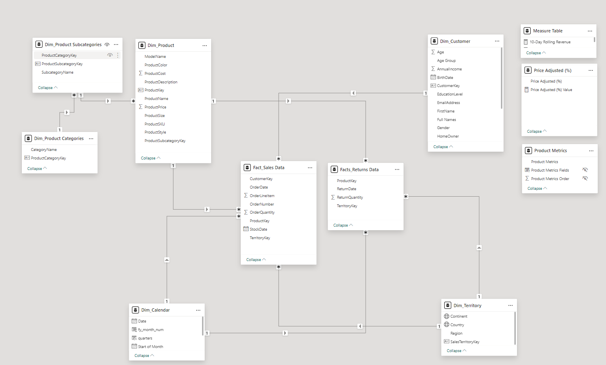

The data model is a **star schema**. There are **2 facts tables** and **4 dimension tables**. The dimension tables are all joined to the fact tables on a **one-to-many relationship**.

## DAX measures
Some of the DAX measures that were created are:
```dax
Total Customers = DISTINCTCOUNT('Fact_Sales Data'[CustomerKey])

Total Orders = DISTINCTCOUNT('Fact_Sales Data'[OrderNumber])

Total Revenue = SUMX('Fact_Sales Data',
'Fact_Sales Data'[OrderQuantity] * RELATED(Dim_Product[ProductPrice]))
```
## Visualization and Analysis
The analysis was divided into **4 dashboard pages**, with each pages targeting specific insights. You can interact with the report [here](https://app.powerbi.com/groups/me/reports/b5c8f5ef-58b0-4096-a1d8-21e3361f0d27/ReportSection?experience=power-bi)

### Page 1: Executive Dashboard
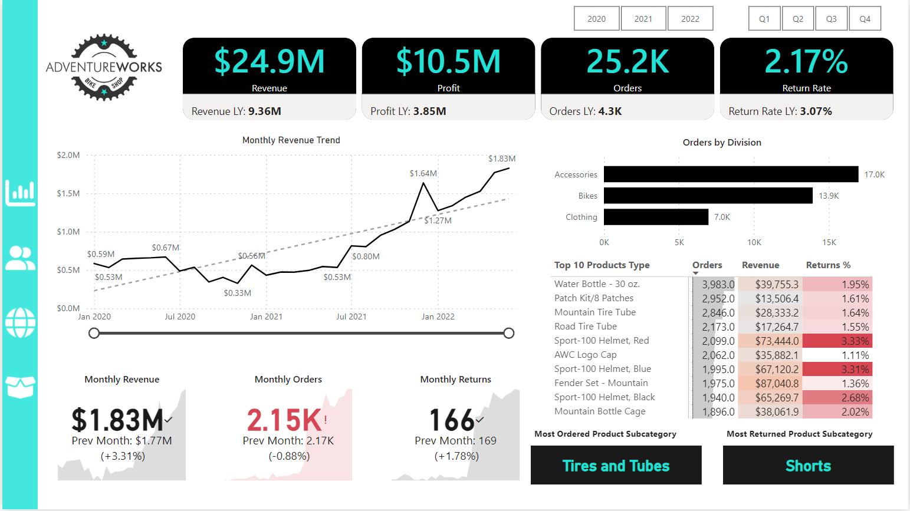

### Key Visuals:
**1. Key Performance Indicators Tiles:**
   
  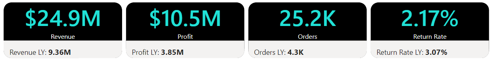

**Insights:** 
- This year, the company recorded a remarkable profit of **$24.9 million**, a substantial increase compared to **$9.36 million** in the previous year.
- Operational profit has also seen impressive growth, rising to **$10.5 million** this year from **$3.85 million** last year
- The number of product orders has skyrocketed, reaching **25.2k orders** this year, a dramatic improvement from **4.3k orders** in the previous year.
- The return rate has dropped significantly to **2.17%** this year, down from **3.17%** last year, reflecting improved customer satisfaction and operational efficiency.
  
**Recommendation:** 
- Reinvest the increased profits into high-impact areas such as product development, market expansion, and customer acquisition to sustain growth momentum.
- Focus on cost-effective strategies and process improvements to maintain or further enhance operational profit margins.
- Build on the reduced return rate by continuing to prioritize product quality, clear communication, and robust after-sales support.

**2. Business Division Performance:**
   
   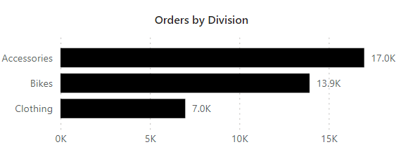

   **Insights:** 
   - The **Accessories division** led in order volume, recording an impressive **17,000 orders**, followed by the **Bikes division** with **13,900 orders**. The **Clothing division** received the fewest orders, totaling **7,000 orders**.

**Recommendation:** 
- Prioritize investment and marketing efforts in the Accessories and Bikes divisions to capitalize on their high demand and further boost sales.
- Develop strategies to increase orders in the Clothing division, such as introducing new designs, offering seasonal promotions, or bundling clothing with popular Accessories or Bikes.
- Conduct customer surveys or analyze purchase patterns to understand why Accessories and Bikes outperform Clothing and tailor the product offerings accordingly.

**3. Products Performance:**
   
   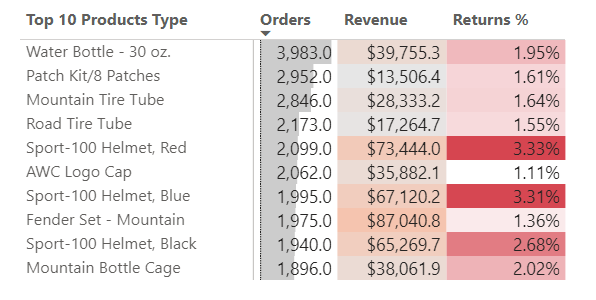

   **Insights:** 
   - The **Water Bottle - 30 oz** achieved the highest number of orders, with an impressive **3,983 orders**. This was followed by the **Patch Kit/8 Patches**, which recorded **2,952 orders**, and the **Mountain Tire Tube**, which brought in **2,846 orders**.
   - The **Fender Set - Mountain** generated the highest revenue, totaling **$87,040**. This was followed by the **Sport-100 Helmet-Red**, which brought in **$73,444**, and the **Sport-100 Helmet-Blue**, with a revenue of **$67,120**.
   - The **Sport-100 Helmet, Red** had the highest return rate at **3.33%**, followed closely by the **Sport-100 Helmet, Blue** at **3.31%**, and the **Sport-100 Helmet, Black** at **2.68%**. In contrast, the **AWC Logo Cap** recorded the lowest return rate, with just **1.11%** of returns.

**Recommendation:**
- Focus on maintaining adequate stock levels and enhancing marketing efforts for top-selling items like the **Water Bottle - 30 oz**, **Patch Kit/8 Patches**, and **Mountain Tire Tube** to sustain and boost sales.
- Prioritize promoting high-revenue products such as the **Fender Set - Mountain** and the **Sport-100 Helmets** to capitalize on their profitability.
- Investigate and address the reasons behind the **high return rates** for the **Sport-100 Helmets** to improve product quality or customer expectations and reduce associated costs.
- Highlight and expand on products with **low return rates**, such as the **AWC Logo Cap**, to increase customer satisfaction and profitability.

### Page 2: Customers Performance
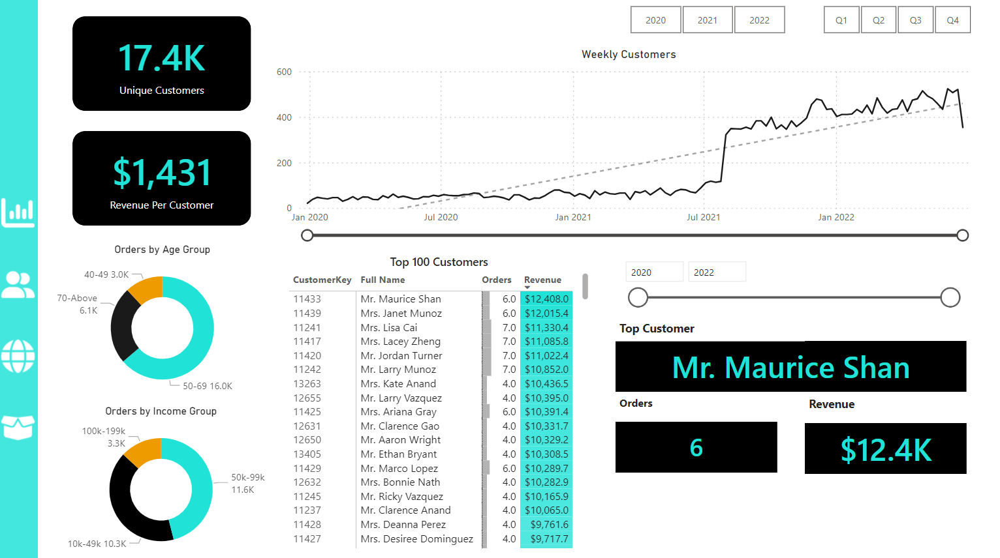

### Key Visuals:
**1. Customers Demographics Performance:**

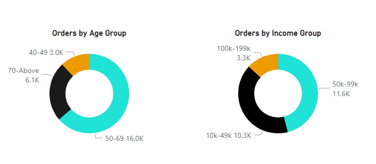

 **Insights:** 
 - The age group **50-69 years** placed the highest number of orders, totaling **16,000 orders**. This was followed by the age group **70 and above**, which recorded **6,100 orders**, and the **40-49 years** age group, with **3,000 orders**.
 - Customers in the income bracket of **$50,000 to $99,000** placed the highest number of orders, totaling **11,600 orders**. This was followed by the **$10,000 to $49,000** income bracket, with **10,300 orders**, while the **$100,000 to $199,000** income bracket recorded the fewest orders at **3,300**.

**Recommendation:**
- Develop marketing campaigns and personalized promotions focused on the 50-69 age group, as they represent the largest customer segment in terms of orders.
- Enhance product offerings and services tailored to the **70+ age group** to further increase their engagement and order volumes.
- Focus on products and pricing strategies that resonate with customers in the **$50,000 to $99,000** and **$10,000 to $49,000** income brackets, as they contribute the majority of orders.
- Explore premium product lines or exclusive offers targeting the **$100,000 to $199,000** income bracket to encourage higher engagement and order volumes.

**2. High Value Customers Performance:** 

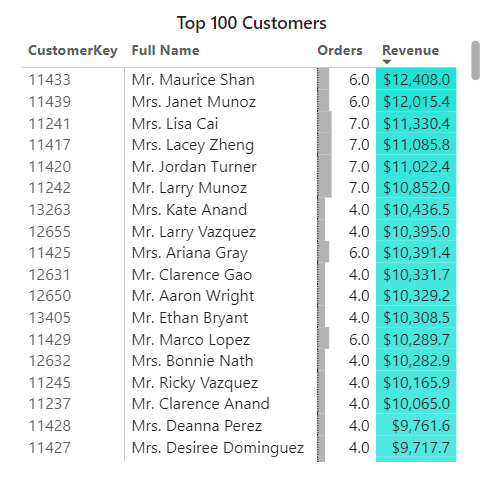

 **Insights:**
 - **Mr. Maurice Shan** emerged as the **top high-value customer**, generating **$12,408** in revenue from just **6 orders**. He was followed by **Mrs. Janet Munoz**, who contributed **$12,015** in revenue from **6 orders**, and **Mrs. Lisa Cai**, who generated **$11,330** in revenue from **7 orders**.

**Recommendation:**
- Develop personalized engagement strategies for top customers like **Mr. Maurice Shan**, **Mrs. Janet Munoz**, and **Mrs. Lisa Cai** to foster loyalty and encourage repeat purchases.
- Offer VIP benefits, such as early access to new products, exclusive discounts, or tailored promotions, to incentivize continued high-value transactions.
- Study the purchasing behavior and preferences of these high-value customers to identify trends and replicate similar success with other customers.

### Page 3: Region/Market Performance
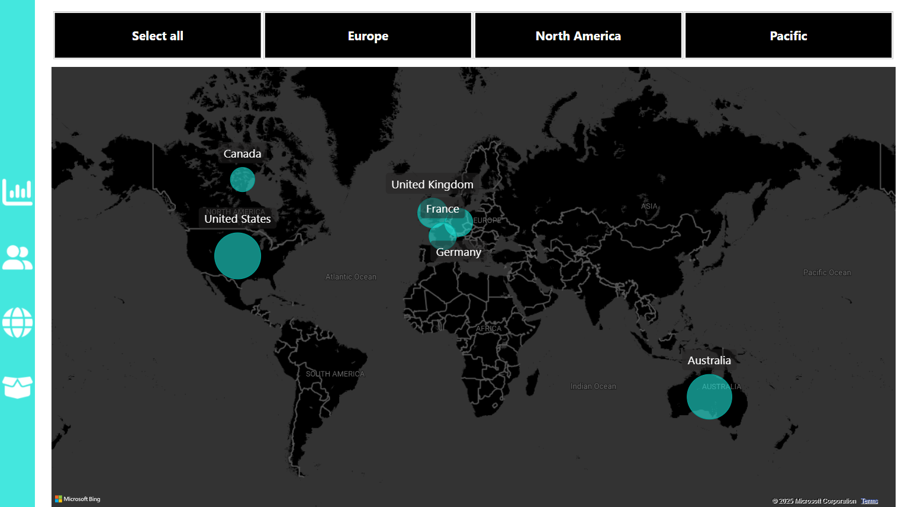

 **Insights:** 
- In the **North America region**, the **United States** generated the highest revenue, totaling **$7.9 million**, followed by **Canada** with **$1.7 million**.
- In **Europe**, the **United Kingdom** led with a revenue of **$2.9 million**, followed by **Germany** with **$2.5 million** and **France** with **$2.3 million**.
- In the **Pacific region**, **Australia**, the company's sole market in the region, generated a revenue of **$7.4 million**.
- Overall, the top three performing markets are the **United States**, **Australia**, and the **United Kingdom**, while **Canada** recorded the lowest revenue across the regions.

**Recommendation:**
- Prioritize investment and strategic initiatives in the **United States**, **Australia**, and the **United Kingdom** to sustain and further enhance revenue growth in these key markets.
- Investigate the factors contributing to **Canada's** lower revenue and implement tailored strategies, such as targeted marketing campaigns or localized product offerings, to drive growth in this market.
- Leverage the strong performance in the **United Kingdom**, **Germany**, and **France** by expanding **product lines**, improving distribution channels, or introducing region-specific promotions to maximize European market potential.
- Consider evaluating the **Pacific region** for **potential new market entries**, building on the strong performance in **Australia**.

### Page 4: Product Performance
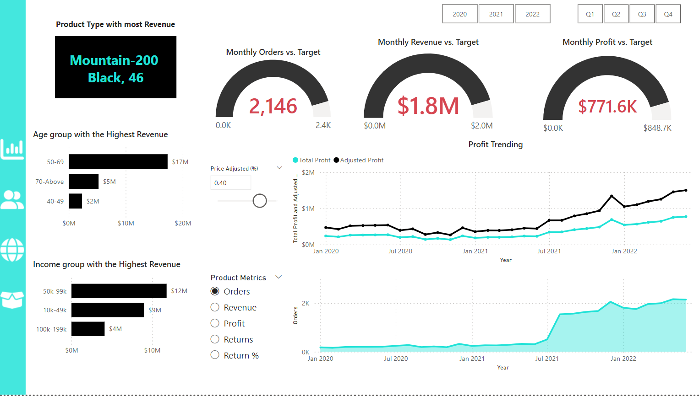

### Key Visuals:
**1. Key Performance Indicator:**

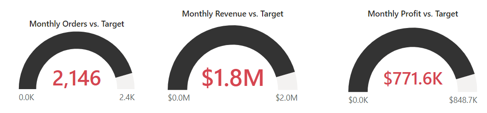

**Insights:** 
- During the month under review, the company fulfilled **2,146 orders**, achieving **89.4%** of the target set at **2,400 orders**.
- The company generated **$1.8 million** in revenue, meeting **90%** of the monthly revenue target of **$2 million**.
- Profit for the month totaled **$771.6k**, achieving **91%** of the profit target set at **$848k**.

**Recommendation:**
- Analyze operational bottlenecks and streamline processes to improve order fulfillment rates, so as to be able to meet the targets in subsequent months.
- Explore opportunities such as upselling, cross-selling, or targeted promotions to close the revenue gap to be able to meet the targets in subsequent months.
- Review cost structures and identify areas to optimize expenses or improve pricing strategies to achieve the profit target.
- Reevaluate current targets to ensure alignment with market conditions and operational capabilities, while maintaining a balance between ambition and feasibility.

### Tools used:
- Power BI: Extract, Transform, and Load. Also, for performing exploratory analysis, dashboard creation, interactivity, and visual analysis.

### Contact Information
Email: luckyodeh001@gmail.com

Linkedin: [linkedin Profile](https://www.linkedin.com/in/lucky-odeh-nosakhare)


   
   

